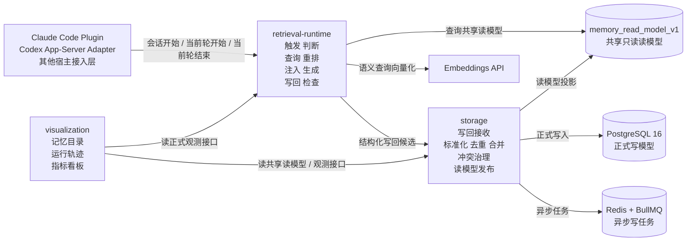

# Continuum

Continuum 是一个面向 agent 的上下文连续性系统。

它要解决的不是“把历史内容存起来”这么简单的问题，而是让过去已经形成的事实、偏好、任务状态和关键事件，能在正确的时刻被重新恢复到当前这一轮里。

换句话说，这个项目做的不是一个被动的记忆库，而是一套围绕 `存储`、`运行时恢复`、`可视化观测` 组织起来的完整机制。

## 这个项目在做什么

这个仓库当前聚焦三件事：

- 把可沉淀的信息结构化保存下来，而不是直接堆原始对话
- 在会话开始、任务切换、规划前、用户提到历史内容等关键时刻，主动恢复上下文
- 把召回、注入、写回、指标和数据源状态清楚展示出来，便于排查和治理

这套设计的核心判断是：

仅有 `storage + retrieval`（存储 + 检索）还不够。

真正决定效果的，是系统能不能在关键时刻稳定地把正确的信息放回当前上下文，而不是等模型“想起来再调用工具”。

## 仓库里现在有哪些部分

当前仓库按三层独立服务来设计：

### 1. `storage`

这一层负责：

- 写回候选接收
- 标准化
- 去重与合并
- 冲突处理
- 生命周期治理
- 共享只读读模型发布

它的目标是把“可查、可治理、可复用”的结构化结果稳定沉淀出来。

### 2. `retrieval-runtime`

这一层负责：

- 宿主接入
- 召回触发判断
- 查询与重排
- 注入块生成
- 一轮结束后的写回检查

它的目标是把过去的信息变成“当前这轮真正可用的上下文”。

### 3. `visualization`

这一层负责：

- 结构化记忆目录
- 单轮运行轨迹
- 指标看板
- 数据源健康状态

它的目标是把这套系统变得可见、可查、可解释，而不是只能翻日志或查表。

## 各层对应技术

当前三层的技术选型先统一成下面这样：

### `storage`

- 语言：`TypeScript`
- 运行时：`Node.js 22 LTS`
- Web 框架：`Fastify`
- 数据库：`PostgreSQL 16 + pgvector`
- 队列：`Redis + BullMQ`
- 数据访问：`Drizzle ORM + 原生 SQL`
- 日志：`Pino`
- 测试：`Vitest`

这一层偏数据落库、规则处理和异步写入，所以重点是结构化存储、一致性和读模型发布。

### `retrieval-runtime`

- 语言：`TypeScript`
- 运行时：`Node.js 22 LTS`
- Web 框架：`Fastify`
- 数据访问：`pg`
- 校验：`Zod`
- 向量能力：外部 `OpenAI-compatible embeddings API`
- 日志：`Pino`
- 测试：`Vitest`

这一层偏运行时编排，所以重点是触发、查询、重排、注入和写回判断。

### `visualization`

- 语言：`TypeScript`
- 框架：`Next.js`
- UI：`React + Tailwind CSS + shadcn/ui`
- 数据请求：`TanStack Query`
- 表格：`TanStack Table`
- 图表：`ECharts`
- 校验：`Zod`

这一层偏展示和排查，所以重点是聚合数据、页面交互和指标解释。

## 服务之间怎么连接

这套系统不是三层代码放在一起跑，而是三层独立服务通过正式契约连接。

连接关系可以先收成这几条：

- `storage` 负责正式写入、治理和共享只读读模型发布
- `retrieval-runtime` 读取 `storage` 发布的共享读模型，并在一轮结束后把结构化写回候选再提交回 `storage`
- `visualization` 不参与主链路决策，只读取 `storage` 和 `retrieval-runtime` 暴露出来的正式接口与观测数据
- 宿主接入层放在 `retrieval-runtime` 前面，当前重点是 `Claude Code plugin`（Claude Code 插件）和 `Codex app-server adapter`（Codex 应用服务适配器）

再具体一点，主链路是这样流动的：

1. 宿主在关键时刻把当前轮上下文发给 `retrieval-runtime`
2. `retrieval-runtime` 判断要不要召回，并读取 `storage` 的共享读模型
3. `retrieval-runtime` 生成本轮注入块，再交还给宿主
4. 当前轮结束后，`retrieval-runtime` 提取写回候选并提交给 `storage`
5. `storage` 完成标准化、去重、合并、冲突处理，再刷新共享读模型
6. `visualization` 读取正式结果和运行轨迹，用来展示和排查

## 架构图谱



## 技术关系一句话理解

- `PostgreSQL + pgvector` 负责把“可存、可查、可排序”的数据基础打稳
- `Fastify` 负责把 `storage` 和 `retrieval-runtime` 做成清晰的独立服务
- `Redis + BullMQ` 负责把写入主链路和后台处理拆开
- `Next.js + React` 负责把结果、轨迹和指标做成真正可看的平台
- 宿主接入层负责把 `Claude Code`、`Codex` 这类 agent 宿主和 `retrieval-runtime` 连起来

## 设计原则

这套项目当前按下面几条原则推进：

- 三层独立开发、独立部署、独立运行
- 任意一个服务没启动，不影响其他服务自身运行
- 允许共享由 `storage` 发布的只读读模型
- 不共享写模型，不直接引用对方内部实现
- 记忆不是原始对话归档，而是结构化、可复用的信息
- 召回不完全依赖模型自己决定，关键时刻由系统触发
- 注入尽量少，但必须够用
- 写回有选择，不把每轮对话都变成记忆

## 这个仓库目前的状态

当前仓库还处在“设计和骨架初始化”阶段。

已经完成的内容主要是：

- 产品基线
- 三层模块边界
- 宿主接入方案调研
- 实施级设计文档
- 三层独立代码目录骨架
- 面向三个独立开发 agent 的开发提示词

还没有开始进入真正的服务实现、数据库迁移、接口落地和页面开发阶段。

## 仓库结构

```text
.
├── docs/
│   ├── storage/
│   ├── retrieval/
│   └── visualization/
├── services/
│   ├── storage/
│   ├── retrieval-runtime/
│   └── visualization/
└── README.md
```

## 从哪里开始看

如果你是第一次进入这个仓库，建议按这个顺序阅读：

1. `docs/product-baseline.md`
2. `docs/architecture-independence.md`
3. `docs/memory-module-contract.md`
4. `docs/README.md`
5. 各子目录下的实施规格和开发提示词

## 仓库名称为什么叫 Continuum

`Continuum` 这个名字强调的是“连续性”。

这个项目真正想解决的，是 agent 在多轮、多任务、多次重开之后，仍然能把上下文连续起来，而不是把“记忆”理解成一个静态仓库。
