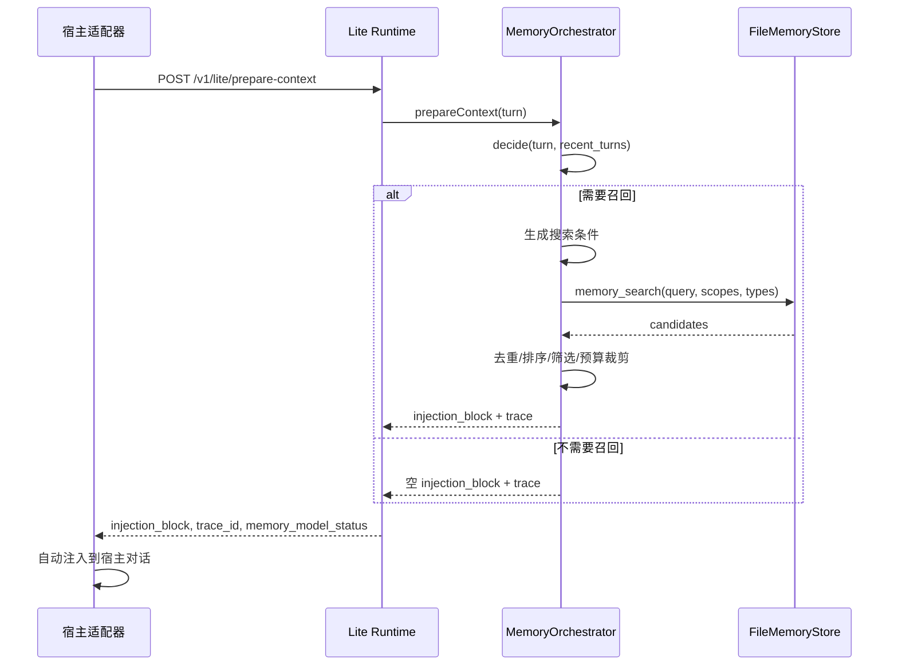

# Axis Lite 模式完整实施文档

## 概述

### 当前问题

Axis 当前定位是"本地微服务平台"：Docker + PostgreSQL/pgvector + storage + retrieval-runtime + visualization + MNA 多服务架构。用户的首次体验是：

```
axis start → 需要 Docker → 需要配数据库 → 需要配 embedding → 需要配 LLM → 才能用
```

用户在第 2 步就跑路了。产品形态太重，门槛太高。

### 目标体验

用户首次应该是：

```
axis claude install → 自动拉起本地进程 → 正常聊天 → 自动有记忆
```

用户感知是"我的 Claude Code 突然有长期记忆了"，不是"我要部署一个系统"。

### 核心原则

1. **Host-first**：首入口是 Claude Code / Codex 宿主适配器，不是 Dashboard
2. **Lite-by-default**：默认单进程 + 文件存储，不依赖 Docker/Postgres
3. **Full-on-demand**：治理/可视化/大规模检索按需以完整模式打开
4. **记忆模型编排主导，规则兜底**：Axis 记忆模型决定记什么、回什么，程序做安全校验、性能保护和降级执行
5. **Lite 不 embedding 化**：精简模式只保存明文 JSON/JSONL 记忆，不生成向量、不配置 embedding、不提示 embedding
6. **自动注入，不让宿主主动调用**：宿主通过适配器被动接收注入结果，不通过 MCP 主动调用 Axis

---

## 一、三层架构

```
┌──────────────────────────────────────────────┐
│              宿主适配层 (Host Adapter)          │
│                                              │
│  Claude Code Plugin    Codex Proxy           │
│  - 采集 turn 上下文    - hook / proxy 通信      │
│  - 自动注入记忆到对话   - 接收记忆模型结果       │
│  - 触发 after-response  - 提交对话事件          │
│                                              │
│  用户入口: axis claude install / axis codex use │
└────────────────────┬─────────────────────────┘
                     │ localhost HTTP
                     │
┌────────────────────▼─────────────────────────┐
│            本地轻量核心 (Lite Runtime)          │
│                                              │
│  单一 Node.js 进程                             │
│  - 无 Docker 依赖                              │
│  - 无 PostgreSQL 依赖                          │
│  - 使用 .axis/memory/ 本地文件存储               │
│  - 暴露 HTTP API 给宿主适配器                    │
│  - 内置记忆模型编排层                            │
│  - 内置记忆模型 function call: memory_search     │
│  - 内置 writeback 管线 (提取 → 精炼 → 追加)      │
│  - 单写队列保护 JSONL 写入                       │
│                                              │
│  启动方式: 宿主适配器自动拉起 或 axis start       │
└────────────────────┬─────────────────────────┘
                     │ axis start --full
                     │ axis migrate --to full
                     │
┌────────────────────▼─────────────────────────┐
│           完整平台模式 (Full Platform)           │
│                                              │
│  Docker + PostgreSQL + pgvector               │
│  - storage service (写入、治理)                │
│  - retrieval-runtime (高级召回)                │
│  - visualization (Dashboard)                  │
│  - memory-native-agent (参考实现)              │
│  - embedding 向量检索                          │
│  - 复杂治理、关系展开、批量维护                   │
│                                              │
│  启动方式: axis start --full                   │
└──────────────────────────────────────────────┘
```

**关键**：三层之间共享契约（API 请求/响应格式 + 文件格式），运行时部署相互独立。Lite core 和 Full platform 的 retrieval-runtime 可以复用业务模块和接口抽象，只是存储后端的实现不同。

### 1.1 记忆模型编排层

记忆模型编排层是 lite runtime 的核心模块，不是一个简单的 `memory_llm` 配置项。代码上表现为 `MemoryOrchestrator` 类，由 lite runtime 初始化和持有，不是独立进程或服务。它接收 turn 上下文，协调内部 function call、`FileMemoryStore` 和 writeback engine，最后输出 injection block 或写入结果。

职责：

- **写入判断**：判断当前 turn 是否值得记忆，生成候选记忆，决定 `memory_type`、`scope`、`status`、`importance`、`confidence`。
- **召回辅助**：判断当前输入是否需要召回，生成搜索条件，调用内部 `memory_search` / `memory_get`，再筛选和组织结果。
- **记忆管理**：在需要时调用内部 `memory_edit` / `memory_delete` 修正旧记忆，但所有改删都必须写入 trace，并通过硬校验。
- **降级状态**：记忆模型不可用时，切到规则触发 + 本地搜索排序；每轮记录是否降级、降级原因和实际使用的策略。
- **调用追踪**：记录每轮记忆模型调用、内部 function call、耗时、命中记录、注入结果和写入结果，供页面和 trace 查看。

边界：

- 宿主适配器只负责提交 turn 和接收 injection block，不决定搜什么、写什么。
- 宿主模型只看到最终注入内容，不直接访问 `memory_search`。
- `memory_search` 是记忆模型内部 function call，不做成 MCP 工具，也不暴露给宿主。
- lite 默认不要求宿主注册或调用 MCP 工具；Axis 通过 hook/proxy 在请求前自动注入，在响应后自动回写。

运行阶段：

| 阶段 | 输入 | 记忆模型编排层动作 | 输出 |
|------|------|-------------------|------|
| before_response | 当前用户输入、最近几轮摘要、宿主/项目 ID | 判断是否召回，生成搜索条件，调用内部 `memory_search`，筛选候选，生成注入块 | `injection_block`、命中记录、降级状态 |
| after_response | 当前用户输入、助手回复、工具结果摘要、before trace | 判断是否写入，生成候选记忆，去重/改写/删除旧记忆，写入 JSONL | 写入结果、过滤原因、变更记录 |
| inspect | trace_id / record_id | 汇总本轮记忆模型调用、内部 function call 和文件写入结果 | 页面可读的 trace |

追踪字段：

```json
{
  "trace_id": "trace_abc",
  "phase": "before_response",
  "memory_model": {
    "enabled": true,
    "degraded": false,
    "degradation_reason": null,
    "model": "claude-haiku-4-5-20251001",
    "duration_ms": 320
  },
  "function_calls": [
    {
      "name": "memory_search",
      "arguments": { "query": "中文 回复 偏好", "scopes": ["user"], "limit": 10 },
      "result_count": 2,
      "duration_ms": 12
    }
  ],
  "selected_record_ids": ["rec_123"],
  "injected": true
}
```

降级策略：

- 记忆模型未配置：使用规则触发器 + 本地关键词/类型/scope/重要性排序。
- 记忆模型超时：保留本地搜索结果，生成基础注入块，并记录 `memory_model_timeout`。
- 记忆模型返回非法 JSON：丢弃模型结果，使用规则结果，并记录 `invalid_memory_model_output`。
- 文件写入失败：写入 `writeback-outbox.jsonl` 或返回可重试状态，不能阻塞宿主正常回复。

### 1.2 规则触发器

规则触发器是记忆模型不可用或快速路径命中时的轻量召回决策器。它不调用 LLM，只基于 phase、输入特征和稳定 ID 生成是否搜索以及搜索条件。

默认规则：

- `session_start`：总是搜索 `workspace` + `user` 范围的高重要性记忆。
- `task_start` / `task_switch`：如果有 `task_id`，优先搜索 `task_state`；同时补充 `workspace` 范围的项目约定。
- `before_response`：检测当前输入是否包含历史引用词，如“上次”“之前”“约定”“继续”“按刚才”“和以前一样”“remember”“previous”“same as before”。命中才搜索；未命中返回空 injection block。
- `after_response`：不做召回，只参与写入候选生成和硬校验。
- 所有规则都要遵守 scope、memory_type、importance 和返回数量限制。

---

## 二、存储设计

### 2.1 目录结构

```
.axis/
  config.json                   # 全局配置
  memory/
    records.jsonl               # 记忆记录（一行一条 JSON）
    traces.jsonl                # 可观测性数据（可选）
    writeback-outbox.jsonl      # 写入出箱（重试用，可选）
```

### 2.2 config.json

```json
{
  "version": 1,
  "mode": "lite",
  "user_id": "user_abc123",
  "memory_llm": {
    "base_url": "https://api.anthropic.com",
    "model": "claude-haiku-4-5-20251001",
    "protocol": "anthropic",
    "configured": true
  },
  "migration": {
    "full_declined_at": null
  },
  "hosts": {
    "claude_code": {
      "installed": true,
      "config_path": "~/.claude/claude-code-plugin.json"
    }
  }
}
```

说明：

- lite 模式的 `config.json` 不出现 embedding 配置，不生成 embedding，不提示用户配置 embedding。
- 记忆模型密钥不写入 `config.json`。密钥放在现有 managed secrets、环境变量或系统凭据存储中，`config.json` 只保存是否已配置和非敏感元数据。
- 只有执行 `axis migrate --to full` 或 `axis start --full` 后，才进入 full mode 的 embedding 配置和向量化流程。
- 用户选择“不迁移到 full”后，用 `migration.full_declined_at` 记录一次，避免每次启动完整平台都重复打扰。

### 2.3 记忆模型配置

lite 模式不需要 embedding，但需要把“记忆模型”作为独立配置入口。它决定召回判断、写入判断、改删建议和 trace 解释；未配置时系统仍可运行，但会进入规则降级模式。

用户入口：

```bash
axis memory-model configure \
  --memory-llm-protocol anthropic \
  --memory-llm-base-url https://api.anthropic.com \
  --memory-llm-model claude-haiku-4-5-20251001 \
  --memory-llm-api-key-env ANTHROPIC_API_KEY
```

也支持在宿主安装时一次性配置：

```bash
axis claude install \
  --memory-llm-protocol openai-compatible \
  --memory-llm-base-url https://api.deepseek.com \
  --memory-llm-model deepseek-chat \
  --memory-llm-api-key-env DEEPSEEK_API_KEY
```

配置来源优先级：

1. CLI 参数：`--memory-llm-*`
2. 环境变量：`MEMORY_LLM_*`
3. managed config/secrets：`~/.axis/managed/config.json` 和 `~/.axis/managed/secrets.json`
4. 未配置：进入规则降级模式

保存规则：

- 非敏感字段保存到 managed config：`baseUrl`、`model`、`protocol`、`timeoutMs`、`effort`、`maxTokens`。
- API key 不写入 `config.json`。如果用户传明文 key，只写入 managed secrets；更推荐使用 `api-key-env`。
- lite 的 `.axis/config.json` 只记录 `memory_llm.configured` 这类状态，不保存密钥。
- full mode 复用同一份记忆模型配置，不要求用户重新配置。

首次体验：

- `axis claude install` / `axis codex use` 检测到记忆模型未配置时，可以提示用户是否现在配置。
- 用户跳过配置时，不阻塞安装；lite runtime 用规则触发 + 本地搜索排序运行。
- 页面 Agent 设置里要显示记忆模型状态：已配置、未配置、最近失败原因、是否降级、最近一次健康检查。

lite runtime 暴露状态：

```json
{
  "memory_model": {
    "configured": true,
    "status": "healthy",
    "model": "claude-haiku-4-5-20251001",
    "protocol": "anthropic",
    "degraded": false,
    "last_error": null
  }
}
```

### 2.4 records.jsonl 行格式

每行一条完整的记忆记录：

```json
{
  "id": "rec_7af13afc538f",
  "workspace_id": "550e8400-e29b-41d4-a716-446655440000",
  "user_id": "550e8400-e29b-41d4-a716-446655440001",
  "task_id": null,
  "session_id": "550e8400-e29b-41d4-a716-446655440002",
  "memory_type": "preference",
  "scope": "user",
  "status": "active",
  "summary": "用户偏好中文回复",
  "details": {
    "preference_axis": "response_language",
    "preference_value": "zh",
    "preference_polarity": "positive",
    "stability": "long_term"
  },
  "importance": 5,
  "confidence": 0.9,
  "dedupe_key": "preference:user:response_language:zh",
  "created_at": "2026-04-30T10:00:00.000Z",
  "updated_at": "2026-04-30T10:00:00.000Z"
}
```

**状态流转**：
```
pending_confirmation → active → superseded
                              → archived
```

**tombstone 格式**（删除/更新时追加）：
```json
{"action": "delete", "record_id": "rec_xxx", "deleted_at": "2026-04-30T12:00:00.000Z"}
```

### 2.5 加载策略

启动时全量加载 `records.jsonl` 到内存 Map：

```
1. 逐行读取 JSONL
2. 遇到 tombstone: 标记对应 id 为已删除
3. 遇到正常记录: 如果该 id 已存在 → 比较 updated_at，保留最新
4. 构建内存索引: Map<recordId, MemoryRecord>
5. 同时构建辅助索引:
   - Map<memoryType, Set<recordId>>
   - Map<scope, Set<recordId>>
   - Map<workspaceId, Set<recordId>>
```

5000 条记录 ≈ 2-3 MB 文件，加载耗时 < 100ms。

### 2.6 写入策略

- **新增**：生成 ID（`rec_` + 12 位 hex），设置 `created_at`/`updated_at`，append 行到文件末尾 + 更新内存索引
- **更新**：设置新 `updated_at`，append 新行 + 更新内存索引
- **删除**：追加 tombstone 行 + 从内存索引移除

**为什么用 append-only**：JSONL 对 lite 模式几百到几千条的量级足够简单，也方便排查和备份。P0 使用 lite runtime 进程内串行写队列实现写入顺序化，例如 `writeQueue = writeQueue.then(() => appendLine(...))`。Claude Code 和 Codex 都通过同一个 lite runtime HTTP 进程写入，不允许宿主适配器直接写 `records.jsonl`。P2 如果出现多个 lite runtime 实例共享同一文件的场景，再引入文件锁；正常情况下不应出现多进程同时写同一份 lite 数据。

---

## 三、启动策略

### 3.1 用户命令

| 命令 | 行为 |
|------|------|
| `axis claude install` | 注册 Claude Code 适配器，设置 hook 配置，自动拉起 lite runtime HTTP |
| `axis codex use` | 配置 Codex 适配器，自动拉起 lite runtime HTTP |
| `axis start` | 启动 lite runtime（默认），无参数 = lite |
| `axis start --lite` | 显式启动 lite runtime |
| `axis start --full` | 启动完整 Docker + Postgres + 多服务 |
| `axis ui` | 打开页面（lite 读 lite runtime，full 读完整服务） |
| `axis stop` | 停止当前运行模式 |
| `axis status` | 显示当前运行模式和状态 |

### 3.2 自动拉起逻辑

宿主适配器工作时，如果检测到 lite runtime 未启动：

```
1. Claude Code 触发 hook → 适配器发起 HTTP 请求
2. 请求失败（连接拒绝）
3. 适配器自动 spawn lite runtime 子进程
4. 等待 liveness 探针通过（最多 3 秒）
5. 重试请求
```

`axis claude install` / `axis codex use` 写入的是宿主 hook/proxy 启动脚本，不写 MCP server 作为主路径。宿主不需要主动调用 Axis 工具，适配器会在请求前自动准备上下文、在响应后自动提交回写。宿主适配器通过 localhost HTTP 调用 lite runtime：

```
axis claude install
  → 写入 Claude Code hook 配置
  → hook 调用 host adapter
  → host adapter 检查 http://127.0.0.1:<lite-port>/healthz
  → 未启动则 spawn axis lite-runtime
  → 通过 /v1/lite/prepare-context 和 /v1/lite/after-response 通信
```

---

## 四、工具设计

### 4.1 内置 function call: memory_search

`memory_search` 不是 MCP 工具，也不直接暴露给宿主适配器或宿主模型。它是记忆模型编排层内部使用的 `function call`（函数调用）能力，用来搜索本地明文记忆文件。

调用关系：

```
宿主适配器 → 提交 turn → lite runtime
  → 记忆模型判断是否需要召回
  → 记忆模型调用内置 memory_search
  → 记忆模型筛选/组织结果
  → lite runtime 返回 injection block 给宿主适配器
```

```
名称: memory_search
描述: 在本地记忆文件中搜索与当前对话相关的记忆记录。
     支持关键词过滤、类型过滤、范围过滤。

参数:
  query              string    可选  关键词（空格分隔多词，命中 summary/details）
  memory_types        string[]  可选  ["fact","preference","task_state","episodic"]
  scopes              string[]  可选  ["user","workspace","task","session"]
  importance_min      number    可选  最低重要性 1-5
  limit               number    可选  返回条数上限，默认 10，最大 30

返回:
  {
    records: [
      {
        id, memory_type, scope, summary, details,
        importance, confidence, status, updated_at
      }
    ],
    total: number,
    query: string
  }
```

**搜索逻辑**：
```
1. 从内存索引获取所有 active 记录
2. query 非空: 每条记录的 summary + JSON.stringify(details) 中检测所有关键词
   - 每个关键词命中 +1 分 (score)
   - score = 0 的记录直接排除
3. 应用过滤: memory_type in types AND scope in scopes AND importance >= min
4. 排序: score DESC → importance DESC → updated_at DESC
5. 截断到 limit 条
```

### 4.2 memory_get

`memory_get` 同样是记忆模型内部的 `function call`，用于在 `memory_search` 返回摘要后获取单条记忆的完整详情。

```
名称: memory_get
描述: 获取指定记忆记录的完整详情，包括所有细节字段。

参数:
  record_id   string  必填  记录 ID

返回: 完整的 MemoryRecord 或 null
```

### 4.3 其他工具（P1/P2）

| 工具 | 用途 | 优先级 |
|------|------|--------|
| `memory_list` | 页面或 CLI 列出当前 workspace 的所有记忆 | P1 |
| `memory_edit` | 记忆模型或用户编辑一条记忆 | P2 |
| `memory_delete` | 记忆模型或用户删除一条记忆 | P2 |

这些不是给宿主模型自由调用的 MCP 工具。`memory_edit` / `memory_delete` 可以给 Axis 记忆模型使用，但必须经过结构校验、安全校验、trace 记录和可回滚 tombstone；页面和 CLI 也可以调用同一套能力。

---

## 五、写入链路

### 5.1 路径

```
助手回复 → host adapter 采集 → POST /v1/lite/after-response
  → writeback-engine.extractCandidates()
    → 规则提取 (runRulesOnly)
    → LLM 提取 (writebackPlanner.extract)       ← 可选，有记忆模型时启用
    → 交叉验证 (crossReferenceEngine)            ← 可选
    → 质量标注 (qualityAssessor.assess)           ← 标注但不否决
  → 模型决策: remember / status / type / scope / confidence
  → 硬校验:
    - JSON 结构非法 → 拒绝
    - 含密钥/隐私内容 → 拒绝
    - 与已有记忆 dedupe_key 完全相同 → ignore_duplicate
    - 空泛无主体 → 拒绝
  → append records.jsonl
  → 更新内存索引
```

### 5.2 硬校验清单

**只拦这些，其余全放**：

1. JSON 结构非法 — 必填字段缺失或类型错误
2. 含明显密钥 — 匹配 `sk-`、`api_key`、`Bearer`、`token` 等模式
3. 完全重复 — dedupe_key 与已有记录完全一致
4. 空泛无主体 — summary 长度 < 4 字符，或全为 stop words
5. 临时闲聊 — 如 "好的"、"ok"、"哈哈" 等无信息量文本（可配置 stop list）

**不再由规则拦的**：
- 置信度低 → 标 `pending_confirmation`，不拒绝
- 关键词不明显 → 交给模型判断
- scope 分类不确定 → 交给模型判断

### 5.3 多轮上下文

LLM 提取时，传入的上下文从单轮改为多轮摘要：

```
writebackPlanner.extract({
  current_input: string,          // 当前用户输入
  assistant_output: string,       // 当前助手回复
  tool_results_summary: string,   // 工具执行摘要
  recent_turns: [                 // 前 3-5 轮摘要
    { role: "user", summary: "...", turn_id: "..." },
    { role: "assistant", summary: "...", turn_id: "..." },
  ],
  related_memories: MemoryRecord[], // 已有相似记忆
  rule_hints: CandidateDraft[],     // 规则提取的候选提示
})
```

**注意**：recent_turns 用摘要而非原文，控制 token 成本。

---

## 六、召回链路

### 6.0 prepare-context 时序



`prepare-context` 内部流程：

1. 加载或增量刷新内存索引。
2. 检测记忆模型状态：健康、降级、不可用。
3. 构建搜索上下文：当前输入、前 N 轮摘要、workspace/user/session/task ID。
4. 决定是否需要召回：优先使用记忆模型；不可用时使用规则触发器。
5. 需要召回时：生成搜索条件 → 调用内部 `memory_search` → 去重 → 按 scope/importance/updated_at 排序。
6. 构建 injection block：包含摘要、记录引用、`token_estimate`，并按预算裁剪。
7. 记录 trace：模型状态、function call、候选数量、最终注入记录、降级原因。
8. 返回 injection block；不需要召回时返回空 injection block。

### 6.1 核心变化

**原有链路**（full mode）：
```
preflight → trigger-engine (LLM Judge / semantic fallback)
  → query-engine (embedding search / pgvector)
  → injection-engine → injection block
```

**Lite 链路**：
```
宿主适配器提交 turn
  → 记忆模型判断是否需要记忆
  → 记忆模型调用内置 memory_search(query, types, scopes)
  → FileMemoryStore 搜索 → 返回候选
  → 记忆模型筛选相关记忆
  → lite runtime 生成 injection block
  → 宿主适配器注入到宿主对话
```

**不再需要的组件**（lite 模式下不启用）：
- trigger-engine
- query-engine（Postgres 版）
- injection-engine（或简化为纯格式化）
- recall-preflight
- pgvector

### 6.2 快速路径

对于以下场景，记忆模型编排层不应走复杂判断，应直接生成搜索条件并调用内置 `memory_search`：

1. "之前的约定是什么", "上次我们怎么做的", "项目里默认用啥"
2. "继续", "按上次的来", "和上次一样"
3. "你叫什么", "你记得我的偏好吗"

这里的“模型”指 Axis 的记忆模型，不是宿主模型。宿主模型只接收最终注入结果。

### 6.3 降级路径

如果 Lite mode 下 Memory LLM 也不可用（用户没配 API key）：

```
规则触发器生成搜索条件 → 调用内置 memory_search → 本地排序截断 → 生成基础 injection block
```

即使没有记忆模型，也不能把大量记忆直接交给宿主模型筛。lite runtime 必须先按 scope、类型、关键词、重要性和时间做本地过滤，控制返回数量。

---

## 七、ID 方案

宿主适配器负责生成和稳定保存 ID：

| ID | 来源 | 持久化位置 |
|----|------|-----------|
| `workspace_id` | 项目首次接入时生成 UUID，并按项目路径稳定保存 | `.axis/config.json` 或项目 `.axis/workspace-id` |
| `user_id` | 安装时生成 UUID | `.axis/config.json` |
| `session_id` | 适配器从宿主获取或生成 | 内存 / 宿主上下文 |
| `thread_id` | 宿主线程 ID，没有则用 session 级别的默认值 | 内存 |
| `turn_id` | 每轮自增或 UUID | 内存 |

**原则**：workspace_id 和 user_id 要稳定持久化，不能每次启动都变。这样记忆才能持续归属于同一个项目和用户。

---

## 八、功能分级

### 8.1 Lite Mode（默认）

| 功能 | 状态 |
|------|------|
| 记忆召回（内部 memory_search） | ✅ |
| 记忆注入（injection block 构建） | ✅ |
| 记忆写入（writeback） | ✅ |
| 基础 memory list 页面 | ✅ |
| 基础 trace 查看 | ✅ |
| 记忆模型配置 | ✅ |
| **不**需要 Docker | — |
| **不**需要 PostgreSQL | — |
| **不**需要 embedding | — |
| **不**需要 pgvector | — |

### 8.2 Full Mode（`axis start --full`）

| 功能 | 状态 |
|------|------|
| 以上所有 lite 功能 | ✅ |
| PostgreSQL + pgvector 存储 | ✅ |
| embedding 向量检索 | ✅ |
| 复杂治理（批量合并、归档、降级） | ✅ |
| 记忆关系展开 | ✅ |
| 批量维护调度 | ✅ |
| 大规模语义检索 | ✅ |
| Dashboard 面板 | ✅ |
| 多服务健康检查 | ✅ |

---

## 九、迁移路径

### 9.1 用户体验

用户主动启动完整平台时，如果检测到本机以前用过 lite 模式并且存在本地记忆数据，就给一次明确提示：

```
检测到你之前使用过 Axis 精简模式，里面有 126 条记忆。
是否迁移到完整平台？

[Y] 迁移并启动完整平台
[N] 不迁移，直接启动完整平台
```

行为：

- 选 `Y`：启动 `axis-stack`，把 lite 数据迁移到 full，然后切换到 full。
- 选 `N`：不迁移，不删除 lite 数据，直接启动 full，full 里从空数据开始。
- 非交互环境：默认不迁移，只打印提示；用户可后续手动执行 `axis migrate --to full`。
- 用户已经明确选择过“不迁移”时，不反复打扰；可通过 `axis migrate --to full` 手动迁移。

### 9.2 迁移执行

```
axis migrate --to full
```

内部步骤：

1. 检测 lite 数据是否存在；没有则跳过。
2. 暂停 lite 写入或让宿主适配器短暂排队，避免迁移期间新增数据漏掉。
3. 按现有 CLI 流程启动 `axis-stack` 单容器（等价于 `axis start --full`），不引入 Docker Compose。
4. 读取 `records.jsonl` / tombstone / `traces.jsonl`，生成迁移计划。
5. 按 storage service 的 `/v1/storage/write-back-candidates` 契约分批导入记忆，批量大小不超过 50。
6. 等待 projection 状态完成，确认 read model 可用；embedding 进入 full 后异步生成。
7. 写入迁移映射：保存 `lite_record_id → full_record_id`、`trace_id` 映射和导入状态。
8. 原子切换 `config.json` 的 mode 为 "full"，宿主适配器改为调用 full runtime。
9. 保留 lite 数据文件作为只读备份。

### 9.3 内部兼容处理

这些兼容细节不需要暴露给用户，但迁移实现必须处理：

| 差异 | full mode 要求 | 兼容策略 |
|------|----------------|----------|
| ID 格式 | storage API 当前要求 `workspace_id` / `user_id` / `task_id` / `session_id` 为 UUID | lite 一开始就应生成 UUID；若已有非 UUID，迁移时生成 UUID 映射并写回 `.axis/config.json` / workspace id 文件 |
| 记录 ID | full 记录 ID 由 storage 生成 UUID | 保留 `lite_record_id` 到 `details.source_lite_record_id`，并写迁移映射表 |
| memory_type | full 只接受 `fact` / `preference` / `task_state` / `episodic` | dry-run 阶段校验并转换旧类型，无法转换的标记为待确认 |
| scope 约束 | `user/task/session` scope 必须有对应 ID | 迁移前补齐 ID；缺失 task/session 时降级到 user/workspace 或标记为待确认 |
| status | full 支持 active / pending_confirmation / archived / deleted 等状态 | lite tombstone 转成 delete/archive 操作；pending 保留为 `pending_confirmation` |
| details | full 要求结构化 details | 不符合结构的内容放入 `details.raw_lite_details`，并补齐最小结构字段 |
| idempotency | full writeback 依赖 idempotency_key 去重 | 用 `lite-migrate:<lite_record_id>:<updated_at>` 生成稳定 key，保证重复迁移不会重复写 |
| 编辑/删除历史 | lite 用 append/tombstone | 导入最新有效快照，同时把旧版本和 tombstone 转成 trace / history 备注；能映射的删除走 storage delete/archive |
| trace | lite trace 是 JSONL，自由度更高 | 转成 runtime observability 的 turn/plan/recall/injection/writeback 记录；无法映射字段保留在 raw payload |
| embedding | lite 不生成 embedding | 迁移成功后由 full storage/read model 异步生成，迁移命令只等待 projection 可用，不要求同步完成所有 embedding |
| 治理/关系 | lite 默认没有完整治理关系 | full 启动后由维护任务重建关系，不在迁移时强行推断 |

### 9.4 切换安全策略

- **迁移要可重入**：重复执行不会重复写入同一条记忆。
- **失败不影响启动**：迁移失败时提示原因，保留 lite 数据；用户可以选择继续启动 full 空数据。
- **迁移要可回滚**：full 切换前失败，继续使用 lite；full 切换后失败，可以根据映射表回到 lite 只读备份。
- **迁移期间不能双写不一致**：要么暂停 lite 写入，要么把迁移期间的新写入放进 outbox，full 导入完成后再补偿。
- **宿主适配器切换要原子**：只有 full runtime readiness 和 storage projection 都通过后，才把 mode 从 `lite` 改成 `full`。
- **页面要显示迁移状态**：包括当前模式、迁移批次、失败记录、跳过原因和 embedding 生成进度。

### 9.5 智能升级提示

满足以下任一条件时提示迁移：

- 记忆数量 > 5000 条
- 单次搜索耗时 > 200ms
- 用户主动运行 `axis start --full` 或 `axis ui` 并打开治理页面

---

## 十、宿主 HTTP 入口改造

### 10.1 当前宿主接入

当前 Codex 侧已有 `memory-mcp-server.mjs`，用于通过 JSON-RPC/MCP 调完整 runtime。lite 模式不再把 MCP 作为主路径，也不暴露 `memory_search`。后续宿主接入应优先走 hook/proxy 自动注入，而不是让宿主模型通过 MCP 主动调用 Axis。

### 10.2 Lite Runtime HTTP 入口

宿主适配器自动拉起 lite runtime 后，通过 localhost HTTP 调用。HTTP 是适配器内部通道，不暴露给宿主模型作为工具：

```
POST /v1/lite/prepare-context
  输入: host/workspace/user/session/thread/turn/current_input/recent_turns
  输出: injection_block、trace_id、memory_model_status

POST /v1/lite/after-response
  输入: trace_id/current_input/assistant_output/tool_results_summary
  输出: writeback_status、accepted_count、filtered_reasons

GET /v1/lite/healthz
  输出: runtime 状态、文件存储状态、记忆模型状态

GET /v1/lite/traces/:trace_id
  输出: 单轮记忆模型调用、搜索、注入和写入记录
```

### 10.3 MCP 的兼容位置

MCP 只作为历史兼容或 full mode 过渡路径存在，不能作为 lite 的默认宿主接入方式。即使保留 MCP，也只能由 Axis 适配器内部调用 `prepare-context` / `after-response` 这类宿主入口，不能让宿主模型通过 MCP 主动搜索或改写记忆，更不能把底层 `memory_search` 注册成 MCP 工具。

---

## 十一、实施计划

### Phase 0（1-2 天）：核心文件存储 + 搜索

- [x] 实现 `FileMemoryStore` 类（加载/去重/搜索/追加）
- [x] 实现 lite 记忆模型配置读取：managed config/secrets + `MEMORY_LLM_*` 环境变量
- [x] 实现 `MemoryOrchestrator.prepareContext()` 和规则触发器
- [x] 实现记忆模型内部 `memory_search` function call
- [x] 实现记忆模型内部 `memory_get` function call
- [x] 实现进程内 Promise 串行写队列
- [x] 实现 lite runtime HTTP 入口：`prepare-context` / `after-response` / `healthz`
- [x] 单元测试
- [x] Lite runtime E2E：prepare-context 命中/不命中、after-response 写入、规则降级、trace 生成

### Phase 1（2-3 天）：适配器 + CLI

- [x] `axis claude install` 命令：写入 hook 配置，指向 lite runtime HTTP
- [x] `axis codex use` 命令：配置 Codex 适配器，指向 lite runtime HTTP
- [x] `axis memory-model configure` 命令：写入记忆模型 managed config/secrets
- [x] 宿主安装时检测记忆模型配置，未配置则提示可跳过
- [x] `axis start` / `axis start --full` 命令
- [x] 宿主适配器自动检测 lite runtime 是否存在
- [x] 宿主适配 E2E：Claude/Codex 适配器自动拉起 lite runtime、自动注入、不通过 MCP 主动调用

### Phase 2（2-3 天）：写入链路适配

- [x] writeback-engine 增加 lite 写入路径
- [x] 多轮上下文传递给 LLM
- [x] 硬校验逻辑实现
- [x] 写入 E2E：多轮上下文提取、敏感信息过滤、并发写入串行化、outbox 重试

### Phase 3（1-2 天）：页面 + 迁移

- [x] Lite 页面（记忆列表、trace 查看、记忆模型配置）
- [x] 页面 Agent 设置支持记忆模型健康检查和降级状态展示
- [x] `axis migrate --to full` 命令
- [x] 智能升级提示
- [x] 迁移 E2E：启动 full 时提示迁移、选择 Y 后导入、选择 N 后不重复提示、失败后可继续 full 空数据

### Phase 4（持续）：体验打磨

- [x] 增量文件加载优化
- [ ] 5000 条以上自动建议升级
- [ ] 错误提示中文化
- [ ] 文档
- [ ] E2E 稳定性：Windows 路径、端口占用、lite runtime 崩溃恢复

---

## 十二、E2E 测试矩阵

E2E 测试必须覆盖真实用户链路，而不只是单个类的单元测试。默认使用临时 `AXIS_HOME` 和临时 workspace，不能读写用户真实 `.axis` 数据。

### 12.1 Lite Runtime E2E

| 场景 | 步骤 | 期望 |
|------|------|------|
| 规则召回命中 | 写入一条 user preference → 调 `/v1/lite/prepare-context`，输入包含“上次/继续/约定” | 返回非空 injection block，trace 记录 `rule_trigger` 和命中 record id |
| 规则召回不命中 | 写入记忆 → 输入普通问题且无历史引用词 | 返回空 injection block，不把记忆泄露给宿主 |
| 记忆模型未配置 | 不写 memory_llm 配置 → 调 prepare-context | `memory_model_status.degraded=true`，使用规则触发器 |
| after-response 写入 | 调 `/v1/lite/after-response`，助手回复包含稳定偏好 | `records.jsonl` 新增记录，trace 记录 writeback 结果 |
| 敏感信息过滤 | after-response 包含 API key/token | 不写入记忆，返回 filtered reason |
| 并发写入 | 并发 20 个 after-response 请求 | JSONL 行完整、无交错、全部通过单写队列顺序写入 |

### 12.2 宿主适配 E2E

| 场景 | 步骤 | 期望 |
|------|------|------|
| Claude install 自动注入 | 执行 `axis claude install` 到临时配置目录 → 模拟 hook before/after | 自动拉起 lite runtime，通过 HTTP 获取 injection block，不注册 MCP 工具 |
| Codex use 自动注入 | 执行 `axis codex use` 到临时配置目录 → 模拟 proxy 请求 | 适配器自动调用 `/v1/lite/prepare-context`，宿主模型不主动调用 Axis |
| lite runtime 未启动 | 适配器第一次请求连接失败 | 自动 spawn lite runtime，healthz 通过后重试成功 |
| lite runtime 崩溃 | 首次调用成功后杀掉 lite runtime → 再次请求 | 适配器重新拉起，用户请求不中断或返回可解释降级 |

### 12.3 配置 E2E

| 场景 | 步骤 | 期望 |
|------|------|------|
| 配置记忆模型 | 执行 `axis memory-model configure --memory-llm-*` | 非敏感字段进入 managed config，密钥进入 managed secrets 或 env 引用 |
| 跳过记忆模型配置 | 执行 `axis claude install` 并选择跳过 | 安装继续，lite runtime healthz 显示规则降级 |
| 页面健康检查 | 打开 Lite 页面或调用状态接口 | 能看到记忆模型已配置/未配置、最近错误、是否降级 |

### 12.4 Lite → Full 迁移 E2E

| 场景 | 步骤 | 期望 |
|------|------|------|
| 启动 full 提示迁移 | 已有 lite records → 执行 `axis start --full` | 显示是否迁移提示 |
| 选择迁移 | 选择 Y | 启动 `axis-stack`，导入 records，生成 lite/full id 映射，full 查询能看到记录 |
| 选择不迁移 | 选择 N | full 正常启动为空数据，lite 文件保留，记录 `full_declined_at`，下次不重复提示 |
| 迁移失败继续 full | 模拟 storage 导入失败 | 显示失败原因，lite 数据保留，允许继续启动 full 空数据 |
| 重复迁移 | 对同一份 lite 数据执行两次迁移 | 依赖 idempotency，不重复创建记忆 |

### 12.5 E2E 落地文件

建议新增：

```
services/retrieval-runtime/tests/lite-runtime.e2e.test.ts
packages/axis-cli/tests/lite-host-adapter.e2e.test.ts
packages/axis-cli/tests/lite-migration.e2e.test.ts
```

测试约束：

- 所有 E2E 使用临时 `AXIS_HOME`、临时端口、临时 workspace。
- 不依赖真实外部 LLM；记忆模型用 fake provider 或 fixture。
- 不依赖真实用户 Claude/Codex 配置；宿主配置目录全部使用临时目录。
- Docker 相关迁移测试可以分为 mock 版和可选真实 Docker 版；CI 默认跑 mock 版。
- 每个 E2E 必须校验 trace，不只校验接口返回。

---

## 十三、需要新建和修改的文件清单

### 新建

```
services/retrieval-runtime/src/lite/
  file-store.ts          # FileMemoryStore 核心类
  search-handler.ts       # 记忆模型内部 memory_search / memory_get function call 处理
  memory-orchestrator.ts  # lite 记忆模型编排层
  memory-model-config.ts  # lite 记忆模型配置读取和状态解析
  rule-trigger.ts         # lite 规则触发器
  write-queue.ts          # JSONL 进程内 Promise 串行写队列
  lite-routes.ts          # lite 模式 HTTP 路由
  lite-runtime.ts         # lite 模式启动入口
  __tests__/
    file-store.test.ts
services/retrieval-runtime/tests/
  lite-runtime.e2e.test.ts
packages/axis-cli/tests/
  lite-host-adapter.e2e.test.ts
  lite-migration.e2e.test.ts
```

### 修改

```
services/retrieval-runtime/
  src/app.ts                  # 条件性注册 lite routes
  src/config.ts               # 增加 AXIS_MODE / AXIS_MEMORY_DIR 环境变量
  src/writeback/writeback-engine.ts  # 增加 lite writeback 路径

packages/axis-cli/src/
  axis-cli.ts                # 增加 migrate 路由，保持文件瘦身
  start-command.ts           # axis start 默认 lite，--full 走现有 axis-stack
  claude-command.ts          # 改造 install，写入 hook 并指向 lite HTTP
  codex-command.ts           # 改造 use，指向 lite HTTP
  managed-config.ts          # 复用 memory_llm managed config/secrets
  memory-model-command.ts    # 新增轻量命令封装，供 axis-cli 路由调用
  runtime-command.ts         # 支持启动 lite runtime
  managed-state.ts           # 记录当前 mode
```

文件组织约束：

- 优先改造现有 `claude-command.ts`、`codex-command.ts`、`mcp-command.ts`、`start-command.ts`，不要新建一套 `commands/` 目录。
- 如果单文件继续变大，把新增逻辑拆成同目录小模块，例如 `lite-runtime-command.ts`、`lite-config.ts`、`lite-migrate.ts`、`memory-model-command.ts`，再由现有命令文件调用。
- 每个模块只放一类职责，避免继续扩大现有大文件。

### 不动

```
services/storage/            # full mode 专用，不动
services/visualization/      # full mode 专用，不动
trigger-engine.ts            # full mode 专用，不动
query-engine.ts              # full mode 专用，不动
recall-preflight.ts          # full mode 专用，不动
```

---

## 十四、关键设计决策记录

1. **JSONL 而不是 SQLite**：JSONL 零原生依赖，编辑器可直接打开查看。P0 不引入新依赖。Windows 和多宿主并发写入需要单写队列或文件锁，不能假设 append-only 天然无锁安全。P2 若数据量大可考虑 SQLite。

2. **自动注入是主路径**：宿主适配器自动拉起 lite runtime，并通过 localhost HTTP 调用。宿主模型不通过 MCP 主动调用 Axis；MCP 只保留为兼容或 full mode 过渡路径，不能作为 lite 的默认方案。

3. **硬校验只拦 5 类**：规则从"决策者"降格为"门卫"。除了安全和明显垃圾，其余全放。用 `pending_confirmation` 兜底。

4. **不重写 retrieval-runtime**：lite mode 复用现有 Fastify app 和 writeback engine，只是文件存储后端的实现替换了 Postgres repository。核心管线逻辑保持不变。

5. **Lite = 写入全量 + 召回按需**：写入每次都做（不丢记忆），召回由记忆模型编排层决定时机；没有记忆模型时由规则触发器降级处理。

6. **Lite 不 embedding 化**：lite 只保存明文 JSON/JSONL，不生成向量，不存 embedding 配置，也不显示 embedding 警告。迁移到 full mode 时再批量 embedding 化。
